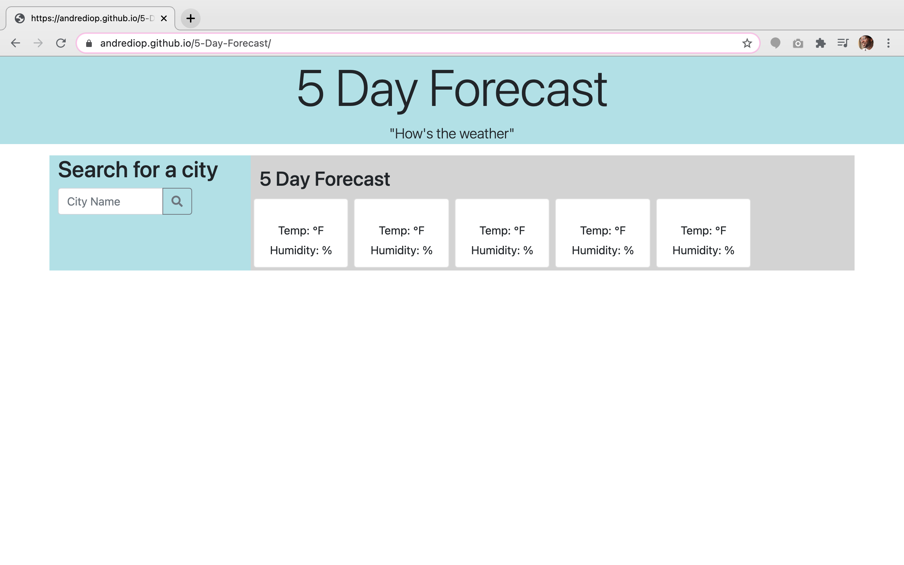
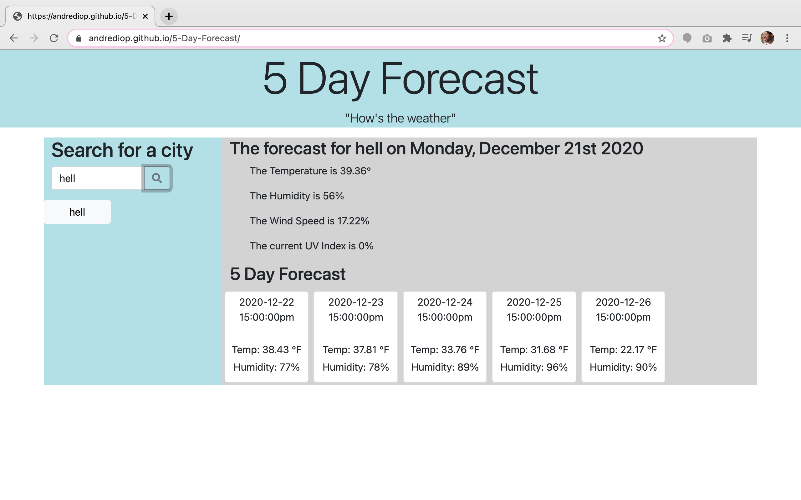

# 5-Day-Forecast

## Table of Contents

[About](https://github.com/AndreDiop/5-Day-Forecast/blob/main/README.md#About)

[Installation](https://github.com/AndreDiop/5-Day-Forecast/blob/main/README.md#Access)

[Usage](https://github.com/AndreDiop/5-Day-Forecast/blob/main/README.md#Usage)

[Screenshots](https://github.com/AndreDiop/5-Day-Forecast/blob/main/README.md#Screenshots)

[Contributing](https://github.com/AndreDiop/5-Day-Forecast/blob/main/README.md#Contributing)

[Licenses](https://github.com/AndreDiop/5-Day-Forecast/blob/main/README.md#Licenses)

# About

On the surface this may seem like just a weather dashboard and it is, however many behind the scenes elements make it work. There are API calls which obtain information to then again make ANOTHER API call to gather more information. There are CDN libraries which deliver the date and display it to the user. Also users input and city searches are saved in local storage and retrieved to be displayed as buttons on the page.

## Access

Users will access the page through either the direct link to the deployed application

```bash
https://andrediop.github.io/5-Day-Forecast/
```

or through the Github repository

```bash
https://github.com/AndreDiop/5-Day-Forecast
```

## Usage
Users are presented with an input form and asked to enter a city name. Once the city name is entered, the current weather will be populated as Temperature, Humidity, Wind Speed and UV index. Additionally, a 5 day forecast will be populated for the next 5 days based on the current date of the request.

## Screenshots

These screen shots show the 5 Day Forecast in different states

```bash
Users are welcomed with this page
```



```bash
Users are presented with info

```



## Contributing

This app could not have been built without the help of fellow students, instructors, tutors, and TA's of the GT coding bootcamp.

Please reach out to me if you see ways that I can improve upon my code and complete the functionality.


## License

[MIT](https://choosealicense.com/licenses/mit/)
5 Day Forecast